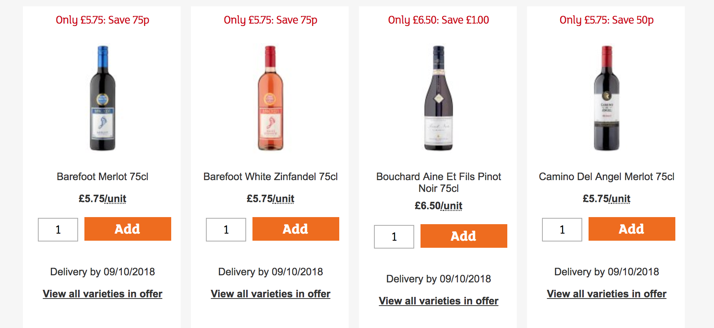

# Sainsbury's Top Tipples API


### Introduction
Quicly hacked up a REST API, which parses Sainsbury's top [tipples page](https://www.sainsburys.co.uk/shop/gb/groceries/find-great-offers/top-tipple) behind the scences and returns back data with regards to the item's name, price and the amount you save on the given offer.

### Requirements
1. Python 3.6
2. Beautiful Soup 4 (V - 4.6.3)
3. Flask (V - 1.0.2)
3. Zappa (V - 0.46.2)


### Instructions

Inorder to run the REST API locally you can carry out the following steps.

1. git clone https://github.com/stefankaransingh/sainsbury_top_tipples.git
2. cd file-path/sainsbury_top_tipples
3. pip intstall -r requiremnts.txt
4. FLASK_APP=main.py flask run

### Demo

Currently there are the following REST API's which are hosted on AWS Lambda.

#### Get Offers

  The below URL allows you to make a ```GET``` request and retrieve all the top tipples offers on page 1. The url also accepts an argument called ```thresholdprice```, that when specified returns back all the offers below the ```thresholdprice```.

  - URL : https://zs9mxnjuw1.execute-api.us-west-2.amazonaws.com/dev/getoffers
  - Example: https://zs9mxnjuw1.execute-api.us-west-2.amazonaws.com/dev/getoffers?thresholdprice=7
  - This retrieves all the offers below the price £ 7.


#### Get Huge Savings

  The below URL allows you to make a ```GET``` request and retrieve all the top tipples offers where you save the most on.

  - URL : https://zs9mxnjuw1.execute-api.us-west-2.amazonaws.com/dev/gethugesavings

### To do.

1. Improve on the API's to retrieve not just the offers on page 1, but also on the remaining pages.
2. Build unit test cases for each of the end points.
